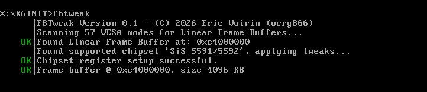

# FBTWEAK

(C) 2026, Eric Voirin (oerg866)

---

**FBTWEAK** is a decoupling of the K6INIT chipset tweaks module into a separate program to allow the user to perform chipset-specific frame buffer acceleration tweaks on Socket 5 / 7 systems without a K6 series CPU.

By default, it tries to find a linear frame buffer address and its size via the VESA BIOS (or PCI/AGP devices if the VESA approach did not work).

It then tries to find a compatible chipset component.

## Supported chipsets

  Supported chipsets:
  - ALi Aladdin III, IV, V
  - SiS 5571, 5581, 5591, 5597, 5598
  - SiS 530, 540

## Command Line Parameters

K6INIT offers several command-line options to configure and manage memory settings, CPU features, and other system parameters. Below is a detailed explanation of each parameter.

### `/?`
**Description:** Prints this list of parameters.

---
### `/nopci`
**Description:** Skips PCI frame buffer detection.

---
### `/novesa`
**Description:** Skips VESA BIOS frame buffer detection.

---
### `/vga`
**Description:** Configure acceleration for the VGA region as well.

Note: Most chipsets don't support this. 

# Building

Follow the regular K6INIT build instructions, then type `nmake FBTWEAK.EXE`

# License

[Creative Commons Attribution-NonCommercial-ShareAlike 4.0 (CC BY-NC-SA 4.0)](https://creativecommons.org/licenses/by-nc/4.0/deed.en)

**FBTWEAK** was built using the [LIB866D DOS Real-Mode Software Development Library](https://github.com/oerg866/lib866d)

