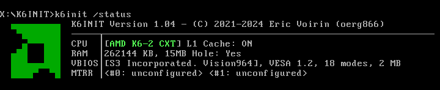
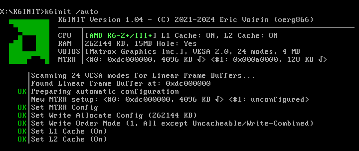
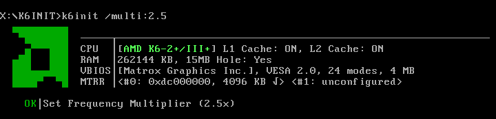

# K6INIT

(C) 2021 - 2024, Eric Voirin (oerg866)





---

**K6INIT** is a driver for MS-DOS that lets you configure special features of AMD K6-2/2+/3/3+ processors, replacing tools like `k6dos.sys` and `setk6.exe`, and is similar to FASTVID on Pentium systems.

While **K6INIT** can run completely autonomously, it supports manual, detailed control over **Memory Type Range Registers** (including Write-Combine and Cachability modes), **Write Allocate**, **Write Ordering**, **CPU Cache** and **Frequency Multiplier**.

In contrast to other tools, **K6INIT** can be loaded from `CONFIG.SYS`, so it works
even with an extended memory manager (such as `EMM386`) installed.

If called with the `/auto` parameter, **K6INIT** does the following:

- *Write Ordering mode* to **1 (All except UC/WC)**
- *Write Allocate* for **all system memory** (auto detected)
- *Write Combining* for **Linear Frame Buffer(s) exposed by VESA BIOS**
  (auto detected)
- *L1 Cache* to **Enabled**
- *L2 Cache* to **Enabled** (supported CPUs only!)

This can be altered and overridden with many command line parameters.

**K6INIT** runs on Chomper Extended (CXT) K6-2 chips or later.

**K6INIT** was built using the [LIB866D DOS Real-Mode Software Development Library](https://github.com/oerg866/lib866d)

## Features

- [x] Detect CPU type automatically
- [x] Detect total available system memory (Using E820 and E801 methods)
- [x] Detect 15-16M Memory hole automatically
- [x] Give precise control over **Memory Type Range Registers (MTRRs)** including **Write-Combine** and **Uncacheable** modes.
- [x] Set MTRR to enable Write combining for Linear Frame Buffers (LFBs) automatically (requires graphics card with VESA BIOS extensions)
- [x] Set Write allocate for system memory
- [x] Set Write Order mode
- [x] Set K6-2+/III+ Frequency Multiplier
- [X] Enable/Disable L1 Cache
- [X] Enable/Disable L2 Cache (K6-2+/K6-III/K6-III+ only)

## Supported Processors

| CPU Type                | Family | Model | Stepping |
|-------------------------|--------|-------|----------|
| AMD K6-2 (CXT Core)     | 5      | 8     | C        |
| AMD K6-III              | 5      | 9     | *Any*    |
| AMD K6-2+ / AMD K6-III+ | 5      | D     | *Any*    |

## System Requirements

* Supported AMD K6 family CPU (see above)
* Microsoft MS-DOS 5.0 (or compatible) or higher
    * [X] Microsoft Windows 95/98 support
    * [X] FreeDOS support
    * Other systems such as DR-DOS untested, but should work.


# Running the Driver

Usage (config.sys):
`DEVICE=K6INIT.EXE <parameters>`

Usage (command line):
`K6INIT.EXE <parameters>`

All parameters are case-inensitive. Parameters other than `/auto` should only be used by knowledgeable users.

## Command Line Parameters

K6INIT offers several command-line options to configure and manage memory settings, CPU features, and other system parameters. Below is a detailed explanation of each parameter.

### `/help`
**Description:** Prints this list of parameters.

---
### `/status`
**Description:** Displays the current program status.

---
### `/auto`
**Description:** Fully automated setup.

---
### `/mtrr:offset,size,wc,uc`
**Description:** Enables Write Combining for a specific memory range.
**Parameters:**
  - `offset`: Linear offset (e.g., `0xE0000000`)
  - `size`: Length in kilobytes (e.g., `8192`)
  - `wc`: Write-combine flag (`1` to enable, `0` to disable)
  - `uc`: Uncacheable flag (`1` to enable, `0` to disable)

**Notes:**
  - The `/mtrr` option can be used twice.
  - Discards any MTRRs configured before running the program.

---
### `/lfb`
**Description:** Automatically finds and enables Write Combining for the Linear Frame Buffer (LFB).

---
### `/vga`
**Description:** Enables Write Combining for the VGA memory region (`A0000-BFFFF`).
**Notes:**
  - **Warning:** This option is potentially unsafe. Do not use this memory region for Upper Memory Blocks (UMBs).
  - Equivalent to: `/wc:0xA0000,128,1,0`

---
### `/nomtrr`
**Description:** Disables Memory Type Range Registers (MTRRs) entirely.
**Notes:**
  - Clears any existing MTRRs, including Write-Combined and Uncacheable regions.

---
### `/wa:size`
**Description:** Configures Write Allocate (WA) settings.
**Arguments:**
  - `size`: Memory size in kilobytes.

**Notes:**
  - Set this to `0` to disable Write Allocate.

---
### `/wahole`
**Description:** Forces 15-16 MB memory hole skipping for Write Allocate.
**Notes:**
  - K6INIT detects the memory hole automatically, but this option can be used to force it.

---
### `/wo:mode`
**Description:** Configures the Write Order Mode.
**Arguments:**
  - `mode`: A single digit representing the desired mode.
    - `0`: All memory regions (Slow)
    - `1`: All except uncacheable or write-combined regions (Fast)
    - `2`: No memory regions (Fastest)

---
### `/multi:x.y`
**Description:** Configures the CPU frequency multiplier.
**Arguments:**
  - `x`: Integral part of the multiplier.
  - `y`: Fractional part of the multiplier.

**Notes:**
  - Requires a K6-2+ or K6-III+ CPU.
  - Example usage: `/multi:5.5`

---
### `/l1:1/0`
**Description:** Enables (`1`) or disables (`0`) the Level 1 cache.

---
### `/l2:1/0`
**Description:** Enables (`1`) or disables (`0`) the Level 2 cache.
**Notes:**
  - Only K6-2+ and K6-III+ CPUs have an on-die L2 cache.

---

# Building **K6INIT**

## Required Build Environment

* MS-DOS 6.xx or 7.xx or Windows 95/98
* Microsoft C / C++ Compiler Version 7.00
  * latest patch set required
  * Also works with Microsoft Visual C++ 1.52. This is not recommended because it is not really meant for pure DOS development.

    In this case you need a 32-Bit DOS Extender such as HX-DOS. The DOSXNT that is included doesn't play nice with my machine sadly.
* `LIB` and `INCLUDE` directories from the **DOS Internals** disk bundled with **Geoff Chappell's* excellent book of the same name
    Can be acquired here: https://www.pcjs.org/software/pcx86/sw/books/dos_internals/

    I have requested permission from *Geoff Chappell* to bundle these files with the **K6INIT** repository, but have not yet received a response.
* Updates for the above libraries from *Geoff Chappell's* website: https://www.geoffchappell.com/notes/dos/internals/crtdrvr/update.htm?ta=8.714286804199219&tx=6
* DPMI host (not necessary on Windows)
  * I use HXDPMI32 ([part of HXDOS by Japheth](https://www.japheth.de/HX.html)).

*Note: Previous versions required the Microsoft Macro Assembler to build. As LIB866D includes macros that allow the usage of unsupported opcodes in inline assembly, this is no longer the case.*

## Building

```
cd <somewhere>\k6init
nmake
```

That's all.

### Borland and Watcom Compiler support

While **Borland C/C++ 3.x**, **Borland Turbo C/C++ 3.0** and **OpenWatcom v2** are technically supported, the resulting executable will not be loadable in `CONFIG.SYS`. Use the following commands to compile them:

#### Borland Turbo C/C++:

`tcc -wall -g1 -Ilib866d -ek6init.exe lib866d\*.c k6init.c`

#### Borland C/C++:
`bcc -wall -g1 -Ilib866d -ek6init.exe lib866d\*.c k6init.c`

#### OpenWatcom:
`wcl -wcd111 -w9 -bt=dos -Ilib866d lib866d\*.c k6init.c`

## Build environment issues

I developed this on an AMD K6-II CXT 500MHz. DOS is not the most stable and easy to configure environment in the world and there are a few quirks to address.

### Weird errors when building

**USE HIMEM.SYS THAT COMES WITH MICROSOFT C/C++ 7.00!**

You'll get weird errors otherwise. It's something to do with XMS size. I can get this to compile with JemmEx when limiting its reported size to 32MiB.

QEMM '97 also works, but after a while I got really strange behavior. I cannot open K6init.h (and only that file) properly via network share anymore.

### Linker doesn't run when DPMI host is running

I couldn't really fix this, so I took the linker (`LINK.EXE` and `CVPACK.EXE`) from Microsoft Visual C++ 1.52. **NOTE:** The linker from VC1.52 requires a 32-Bit DOS Extender.
VC1.52 includes one in the form of `DOSXNT.EXE`

### CodeView doesn't run when DPMI host is running

No idea. I don't use the debugger (yet) so at the moment it is not a big deal for me but it would be cool to fix this...?

### Why don't you just use 386-MAX as suggested by Microsoft?`

Because when I load it, it reboots my computer. %-)

# License

[Creative Commons Attribution-NonCommercial-ShareAlike 4.0 (CC BY-NC-SA 4.0)](https://creativecommons.org/licenses/by-nc/4.0/deed.en)
